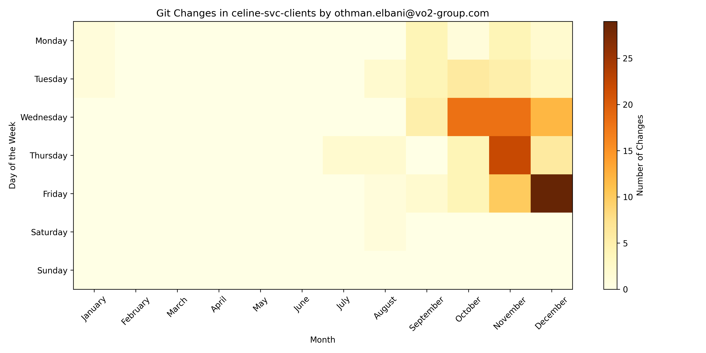
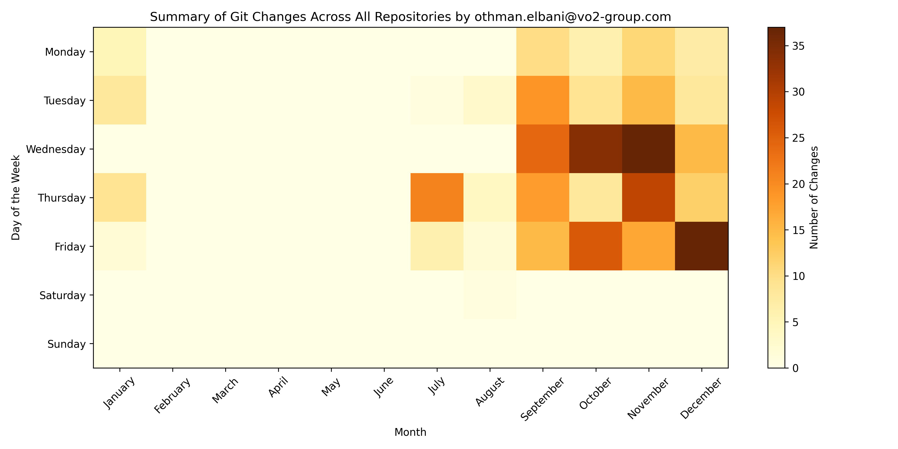

# Git Log Heatmap Generator

A Python script that generates heatmaps visualizing commit activity by day of the week and month for Git repositories. The script processes multiple repositories, creates individual heatmaps for each repository, and generates a summary heatmap aggregating data across all repositories.

---

## Table of Contents

- [Git Log Heatmap Generator](#git-log-heatmap-generator)
  - [Table of Contents](#table-of-contents)
  - [Overview](#overview)
  - [Features](#features)
  - [Prerequisites](#prerequisites)
  - [Installation](#installation)
  - [Usage](#usage)
    - [Command-Line Arguments](#command-line-arguments)
    - [Example](#example)
    - [Output](#output)
  - [Example Output](#example-output)
  - [Contributing](#contributing)
  - [License](#license)

---

## Overview

This script analyzes Git commit logs to generate heatmaps that visualize the distribution of commits by day of the week and month. It supports filtering commits from the past 12 months and can process multiple repositories in a directory. Each repository gets its own heatmap, and a summary heatmap is generated to provide an overview of activity across all repositories.

---

## Features

- **Repository-Specific Heatmaps**: Generate heatmaps for each Git repository.
- **Summary Heatmap**: Aggregate commit data across all repositories into a single heatmap.
- **Time Filtering**: Analyze commits from the past 12 months.
- **Automatic Saving**: Save heatmaps as PNG files without displaying them.
- **Customizable Output Directory**: Save heatmaps in the script's directory or specify another location.

---

## Prerequisites

Before running the script, ensure you have the following installed:

- **Python 3.6+**
- **Required Libraries**:
  - `gitpython`
  - `pandas`
  - `matplotlib`

You can install the required libraries using pip:

    pip install gitpython pandas matplotlib


## Installation

1. Clone this repository or download the script file (`git_log_heatmap.py`).
2. Create a Virtual Environment ```bash python3 -m venv myenv```
3. Activate the Virtual Environment
   1. On macOS/Linux: ```bash source myenv/bin/activate```
   2. On Windows: ```bash myenv\Scripts\activate```

4. Install the required dependencies using the command below:

```bash
   pip install gitpython pandas matplotlib
```
5. Deactivate the Virtual Environment:
   1. When you're done, you can deactivate the virtual environment by running:
```bash
   deactivate
```
## Usage

### Command-Line Arguments

Run the script with the following arguments:

    python git_log_heatmap.py <repo_directory> <author_name_or_email>

- <repo_directory>: Path to the directory containing Git repositories.
- <author_name_or_email>: Name or email of the author whose commits you want to analyze.

### Example
To analyze commits made by "John Doe" in the /path/to/repos directory:

    python git_log_heatmap.py /path/to/repos "John Doe"

### Output
- Individual heatmaps for each repository are saved as <repository_name>_heatmap.png.
- A summary heatmap aggregating all repositories is saved as summary_heatmap.png.
  
Both files are saved in the script's directory by default.

##  Example Output
Individual Repository Heatmap


Summary Heatmap


## Contributing
Contributions are welcome! If you find any issues or have suggestions for improvements, please open an issue or submit a pull request.

## License
This project is licensed under the [MIT License](https://opensource.org/license/mit) . Feel free to use, modify, and distribute the script as needed.

Acknowledgments
Thanks to the contributors of the [GitPython](https://github.com/gitpython-developers/GitPython) library for simplifying Git interactions in Python.
Thanks to [Matplotlib](https://github.com/matplotlib/matplotlib) and [Pandas](https://github.com/pandas-dev/pandas) for providing powerful tools for data visualization and manipulation.